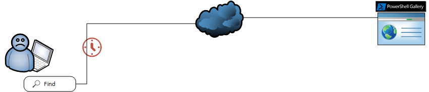
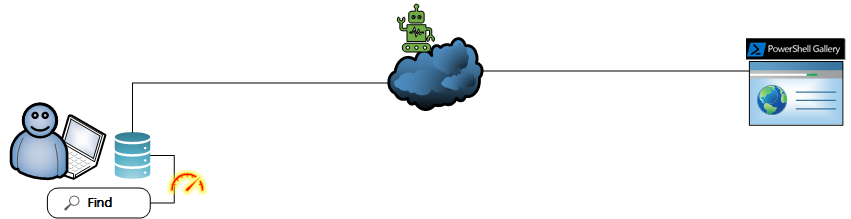
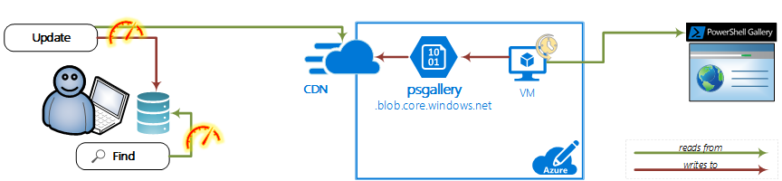

Below you may see technical explanation of current server side implementation.

## Sad Joey

Currently, all `Find-*` operations run over the Internet and last approximately for two seconds each. Joey is not happy because of that.

## Happy Joey

In order to make Joey happy, we need to implement `Find-*` operation to run against local, cached database. For that to happen, also a cloud component is needed.

## Technical details

The implemented solution relies on two sections.

### User side

- User runs periodically `Update-PSRepositoryCache` command which lasts only a couple of seconds and creates/updates local database. Triggering can be done also in other ways (i.e. when importing module, scheduled job, etc.)
- When needed, user runs `Find-*` commands which are executed **100 times faster** than before.

### Server side

- Core of the server side is a Virtual machine running scheduled task with `Create-PSRepositoryCache` command. It reads latest information from PowerShell Gallery and stores it.
- Data is persisted on a blob in the storage account called PSGallery.
- Storage account is further empowered by Content Delivery Network.

### Other ideas

Server side could be ideally deployed on PS Gallery itself, and not on an VM in isolated system. Also, triggering of an update can be done by PS Gallery database system upon update, and not by scheduled task.