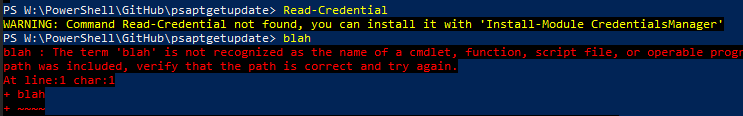

# PowerShell's apt-get update

This module provides functionality for PowerShellGet inspired by `apt-get update` Linux command. This is only proof-of-concept work, though it is (almost) fully functional. 

## Explanation

Currently PowerShell and PowerShellGet are having following two issues\feature requests which are related to each other:

- Finding information about modules and scripts is very slow. It is running over the Internet and last about two seconds. This implementation speeds search commands 100 times, downto 20 ms!
- When user types command which they do not have installed on the system, we can instruct them how to install it in some cases.

Core of the module is local index (cache) of all modules, scripts and commands which is just simply downloaded from the repository.
Generated index file is prepared (generated and zipped) on a dedicated cloud VM, but command for that is also included in the module.
For verification, it can be also executed locally.

It would be good to implement this functionality in PowerShellGet and PowerShell Gallery directly.

For more details, see (illustrated) [design page](Design.md).

## Speed comparison

Actual speed will depend on your local system, namely of a disk and processor speed.
Results below are from medium class personal computer.
On low end machines, results will not be more than 2-3 times slower, which is still 20-50 times faster than already existing commands.

If further speed improvement is needed, simple indexing can increase speed a few times.

### Results for 10 repetitions (in seconds)

  | Find-Command | Find-Script | Find-Module
-- | -- | -- | --
old commands | 22.9751159 | 23.0243 | 23.4820757
new commands | 0.2507481 | 0.188659 | 0.1713624

### How testing was done

Testing was done executing commands similar to the ones below.

```PowerShell
Measure-Command {1..10 | % {Find-Command 'Read-Credential' -Repository 'PSGallery'}} | Select TotalSeconds
Measure-Command {1..10 | % {Find-CommandFromCache 'Read-Credential'}} | Select TotalSeconds
```
Test was repeated 5 times and middle result was recorded.

## Error handling

Module is also updating default `CommandNotFoundAction` error handler. As it is running fast, if it can, it will tell you how to add requested command! Just like in some Linux distros.



## Commands

This module provides following commands:

### Cache Management

- `Update-PSRepositoryCache` - Downloads index file and expands it to local cache, equivalent to `apt-get update` Linux command.
- `New-PSRepositoryCache` - Generates zipped index file and uploads it to storage account. This is running as a scheduled task on dedicated server. Standard users do not need to run it.

### Search and Update Operations

- `Find-ModuleFromCache`   - finds modules in local cache
- `Find-ScriptFromCache`   - finds scripts in local cache
- `Find-CommandFromCache`  - finds command in local cache
- `Update-ModuleFromCache` - finds updatable modules in local cache, it **accepts wildcard '*'**; _for POC it supports -WhatIf simulation only_

## Examples

### Update-Index

```PowerShell
Update-PSRepositoryCache
```

Creates local repository cache. Internet connection is required. Should be run first, before other examples. Command runs for about 4-5 seconds.
If executed with -Verbose switch, you may actually see how old is server version of index file.

### Find-Command

```PowerShell
Find-CommandFromCache 'Get-Folder' | Select -First 3
```

```text
ModuleName                Name       Version         Repository
----------                ----       -------         ----------
VMware.VimAutomation.Core Get-Folder 11.0.0.10336080 PSGallery
WFTools                   Get-Folder 0.1.58          PSGallery
PSFolderSize              Get-Folder 1.6.3           PSGallery
```

This command runs in about 20 milliseconds, which is about 100 times faster than standard `Find-Command`.

### Update all modules

If called without any names, this command will update all modules in the system. In this POC, actual update is not implemented, so you need to run it with `-Verbose` or -`WhatIf` to see actual updatable modules.

Please note from verbose output that commandlet in this mode is processing dozens of modules per second!
Standard commandlet `Update-Module` takes about 15 second to check for update of one module.

```PowerShell
Update-ModuleFromCache -Verbose
```

```text
VERBOSE: 31-Oct-18 10:47:50 PM Update-ModuleFromCache starting
VERBOSE: 10:47:50 PM Reading list of all modules from the system
VERBOSE: 10:48:12 PM checking module ClipboardText for updatable version
VERBOSE: 10:48:12 PM Performing action Update to version 0.1.7 on target Module 'ClipboardText' version 0.1.1
VERBOSE: Performing the operation "Update to version 0.1.7" on target "Module 'ClipboardText' version 0.1.1".
VERBOSE: 10:48:12 PM checking module EasyAzureFunction for updatable version
VERBOSE: 10:48:12 PM Performing action Update to version 0.7.1 on target Module 'EasyAzureFunction' version 0.6
VERBOSE: Performing the operation "Update to version 0.7.1" on target "Module 'EasyAzureFunction' version 0.6".
VERBOSE: 10:48:12 PM checking module fifa2018 for updatable version
VERBOSE: 10:48:12 PM Performing action Update to version 0.2.45 on target Module 'fifa2018' version 0.1.11
VERBOSE: Performing the operation "Update to version 0.2.45" on target "Module 'fifa2018' version 0.1.11".
VERBOSE: 10:48:12 PM checking module Plaster for updatable version
VERBOSE: 10:48:12 PM checking module platyPS for updatable version
VERBOSE: 10:48:12 PM Performing action Update to version 0.12.0 on target Module 'platyPS' version 0.11.1
VERBOSE: Performing the operation "Update to version 0.12.0" on target "Module 'platyPS' version 0.11.1".
```

## External Links

- **`apt-get update`** - [man page](https://linux.die.net/man/8/apt-get), [askubuntu.com](https://askubuntu.com/questions/222348/what-does-sudo-apt-get-update-do)
- **`PowerShellGet`** - [MSFT docs](https://docs.microsoft.com/en-us/powershell/module/powershellget), [GitHub repo](https://github.com/PowerShell/PowerShellGet)
